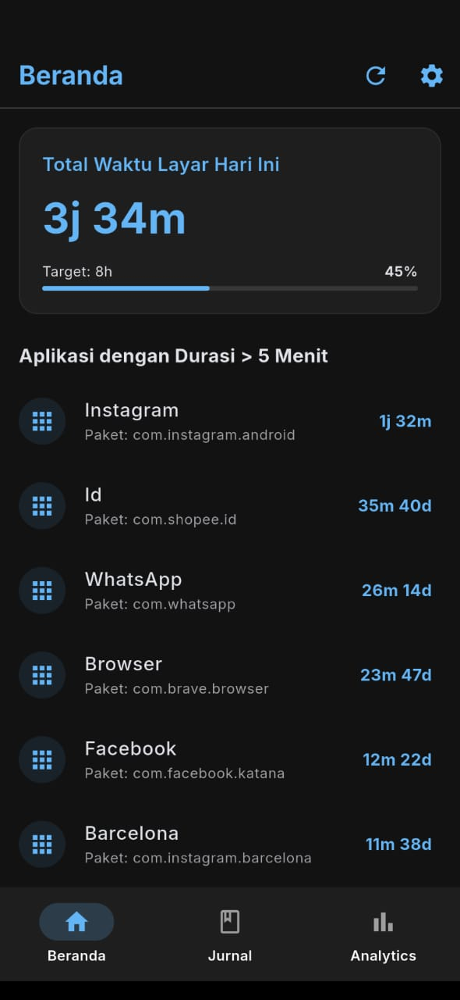
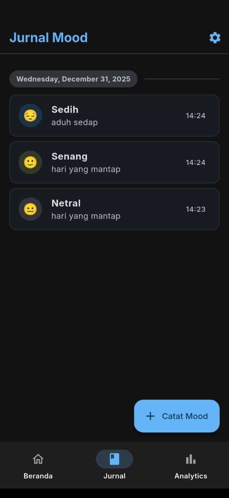
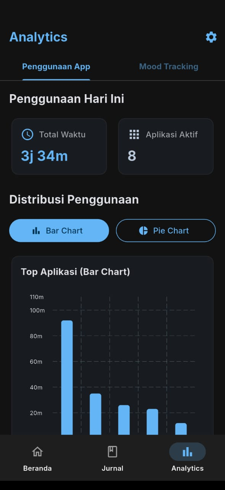
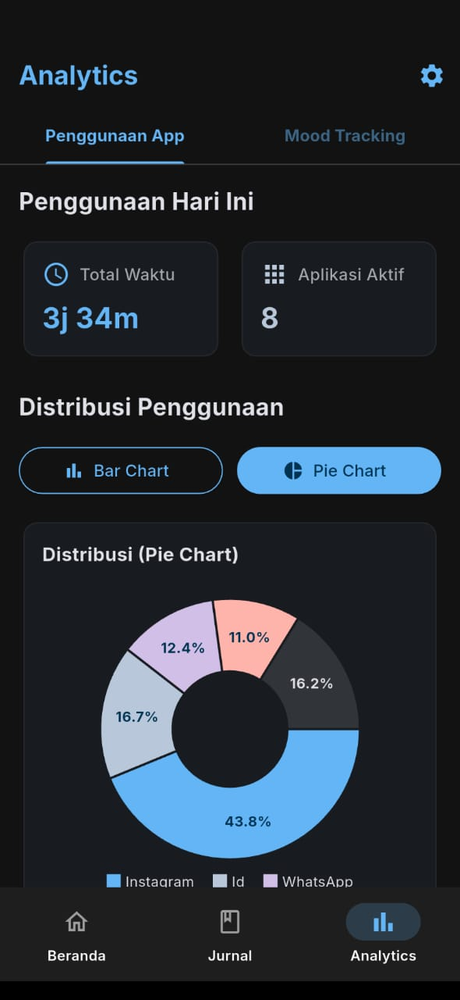
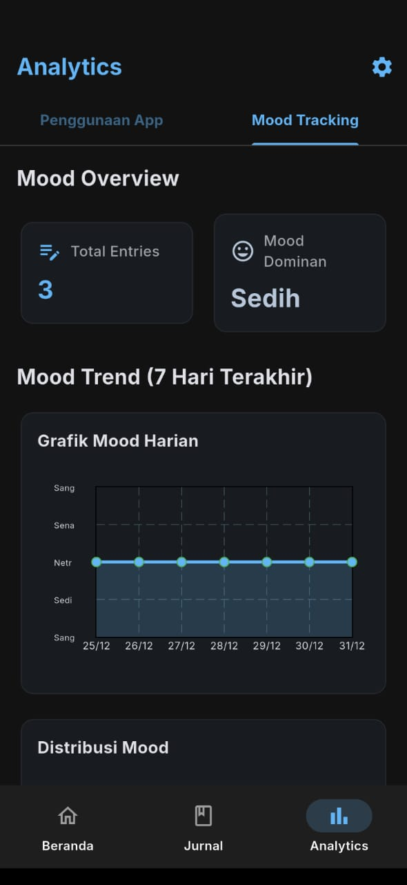
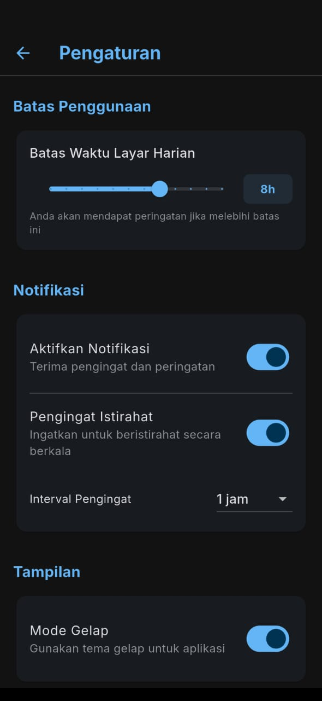

# Digital Wellbeing

A Flutter application designed to help users monitor and manage their digital habits, track app usage, and promote healthier screen time practices.

This project is a fork of [Digital Wellbeing](https://github.com/najimuhammad67/Digital-Wellbeing.git) with UI modernization, a working dark theme, and app detection reduced to mostly user apps.

## Features

- **App Usage Tracking**: Monitor how much time you spend on different applications.
- **Data Visualization**: View usage statistics through interactive charts and graphs.
- **Local Notifications**: Receive reminders and notifications to manage screen time.
- **Data Storage**: Store usage data locally using SQLite database.
- **Settings Management**: Customize app preferences using shared preferences.
- **Cross-Platform**: Supports Android, iOS, and other platforms via Flutter.

## Screenshots

Here are some screenshots of the app in action:

| Screenshot 1 | Screenshot 2 |
|--------------|--------------|
|  |  |
|  |  |
|  |  |

## Getting Started

### Prerequisites

- Flutter SDK (^3.9.2)
- Dart SDK
- Android Studio or Xcode for mobile development

### Installation

1. Clone the repository:
   ```bash
   git clone <repository-url>
   cd DigitalWellbeingNew
   ```

2. Install dependencies:
   ```bash
   flutter pub get
   ```

3. Run the app:
   ```bash
   flutter run
   ```

### Building for Production

- For Android APK:
  ```bash
  flutter build apk
  ```

- For iOS (on macOS):
  ```bash
  flutter build ios
  ```

## Usage

1. Launch the app on your device.
2. Grant necessary permissions for usage stats (Android).
3. View your app usage statistics on the dashboard.
4. Set reminders and customize settings as needed.

## Dependencies

- `provider`: State management
- `usage_stats`: Track app usage (Android)
- `fl_chart`: Data visualization
- `sqflite`: Local database
- `shared_preferences`: Persistent settings
- `flutter_local_notifications`: Local notifications
- `timezone`: Timezone handling

## Contributing

Contributions are welcome! Please fork the repository and submit a pull request.

## License

This project is licensed under the MIT License - see the [LICENSE](LICENSE) file for details.

## Resources

- [Flutter Documentation](https://docs.flutter.dev/)
- [Lab: Write your first Flutter app](https://docs.flutter.dev/get-started/codelab)
- [Cookbook: Useful Flutter samples](https://docs.flutter.dev/cookbook)
